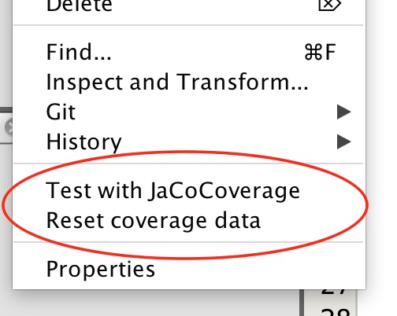

# Codecoverage in Netbeans
The **jacocoverage** tool can be used to display how much of the code is covered by your tests.

When running the tool, it produces a directory with the results of its analysis. This directory should not be put on git, so add the following to .gitignore

```
## jacocoverage directory should not be shared
**/.jacocoverage/
```
The tool can be installed into Netbeans by:

1. In the tools menu, last item is "Plugins".
2. This brings up a little dialog box.
	- Select "available plugins" at the top
	- In the search field type "cover"
	- That should bring up the tool: "TikiOne JaCoCoverage"
	- Select it and press install.
	- Netbeans will need to restart.

To run the tool, one right click on the project, and two new menu entries are now available:


